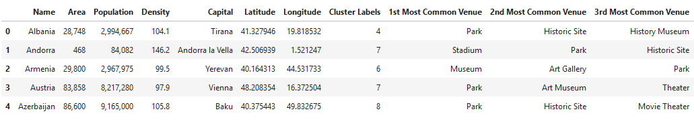

***
<h1>European Capitals Clustering</h1>
<h2>Coursera Capstone Final Project (week 4)</h2>

**Author: Ivan Letal**

Date: 2018/11/06
***

<h1>Introduction</h1>

The culture of Europe is rooted in the art, architecture, film, different types of music, literature, and philosophy that originated from the continent of Europe. 

European culture is largely rooted in what is often referred to as its "common cultural heritage". Because of the great number of perspectives which can be taken on the subject, it is impossible to form a single, all-embracing conception of European culture. Nonetheless, there are core elements which are generally agreed upon as forming the cultural foundation of modern Europe. 

If I could describe European culture in few words, I would say Art, Architecture, Music, Science, Cuisine. 

<h1>Objective</h1>

In this project, I will focus only on capital cities in Europe, as we can assume that they well represent their countries and nations' culture.

Using Machine Learning (clustering) I will put capitals in clusters to determine:
 
* Similarity or dissimilarity of the cities from cultural point of view
* Classification of capitals into clusters and their visualization

Now, for the sake of the project, I will not focus on cuisine (food and restaurants) to describe the culture, because the data I have mostly contain commercial venues that would have significant impact on comparison. The data I use contain various type of restaurants, who knows Europe will know that nowadays you can find all different types of kitchen in every European country.

As a tourist, you might find this information useful, for example, if you liked Prague (Czech Republic) you might as well like Berlin (Germany).

<h1>Data</h1>

The data come from Wikipedia, listing European countries and their capitals. This is pretty straightforward.

https://simple.wikipedia.org/wiki/List_of_European_countries

To complement the data with geolocations like latitude and longitude, I use Geopy libraries that pulls data from Nominatim. 
Geopy makes it easy for Python developers to locate the coordinates of addresses, cities, countries, and landmarks across the globe using third-party geocoders and other data sources.

https://geopy.readthedocs.io
https://nominatim.openstreetmap.org/

The last but not least are data from Foursquare that I access through API. 

https://foursquare.com/

The problem with these data I touched in the Objective section, accuracy of data captured can't determine 100% correct classification in real world. 

But the data are sufficient for this project and study.

For comparison, I find the text cloud the best.

As you can see, Berlin and Prague are similar cities. At least from view of culture. What connects them are: Museum, Theatre, Art, Opera, Concert, Architecture.

But in the project (week 5) I will show in detail how Machine Learning evaluates the clusters.

